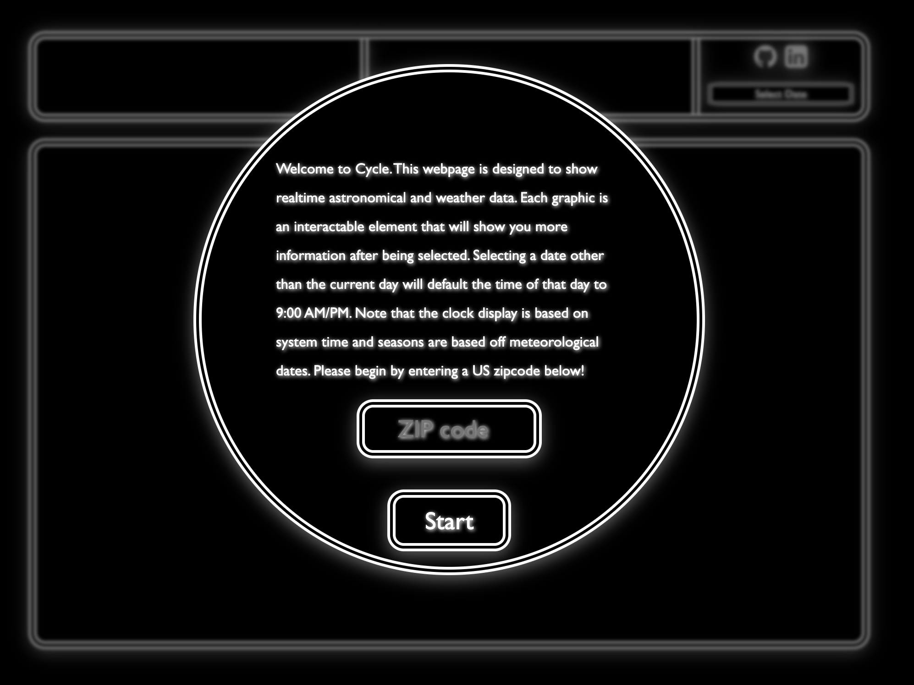

# Cycle

## <b>[Wire frame diagram](./project_docs/cycle_wire_frame.pdf)</b>
   # 
## [Try it here!](https://kaiterwu.github.io/Cycle_js_proj/)

## <u>Background</u>

Cycle is a data visualization that grabs data from the VisualCrossing weather api  https://www.visualcrossing.com/; it includes several different datapoints such as moon index, sunrise/sunset, and other weather statistics. The goal of this API is to visualize these statistics in series of circular like elements that can be interacted with on the page. 

In cycle, the users will be able to click on an element such as the "sunrise/sunset" bar and see a visualization of this data in the form of a circle that will be drawn based on the percentage/value of the statistic being shown. ie, the sunrise/sunset bar will animate based on time of day and will display when sunset is,and will display when sunrise is. Other features include a realtime clock that will animate using setinterval, and grabbing data from prevous dates. This API allows us to grab data from up to several decades. Users should also be able to input their zipcode so to see data for their current location. 

See [here](./project_docs/cycle_wire_frame.pdf) to see a drafted visualization of the project. 

## <u>Libraries and Methods</u>
All graphing elements in this project are rendered with the basic D3 library. Vanilla JavaScript, JavaScript HTML DOM, and CSS were utilized. Wepback was used to bundle JavaScript code while npm was used to handle project dependencies. 
### Implementation 
D3 was used to implement the visualization of concentric circles. It was decided early on to use Modals in order to 
keep the organization of the project clear. Two modals were used in total that are rerendered using JavaScript HTML DOM 
methods. 
#### User Modals

# 
# 

The above pages share the same modal. 
### Figure Modals
For the main page, 7 total different pages render based on the element selected. Elements are indicated to be selected with a simple CSS hover effect. Both the figures on the main page and the ones rendered on the modal pages are dynmically generated based on data fetched at time of date selected. See below for all possible pages. 

# 
# 
# 
# 
# 
# 
# 

## <u>Implementation timeline</u>
3/9 to 3/12 -Complete initial research on how to animate certain elements and how to set up skeleton for grabbing data from API and utilizing them in project. Build documentation on javscript implementations I want to use and plan 
Create basic visualization of data in project and be able to ouput data in any form.

3/13-  Try to utilize D3 to create a simple graph. Make sure project can render data without reloading page. Make real time clock using setInterval. Finish basic skeleton for page. 

3/14- Complete visualization for at least one element, begin to add logic for other elements. Begin working on animating logic for each element. Make sure logic can work on data from past dates.

3/15- Complete visualization for all desired elements, try to work on animation logic for each element. Put final touches on CSS and colors.

